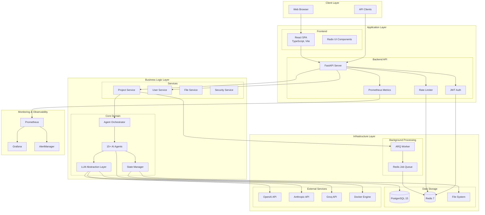
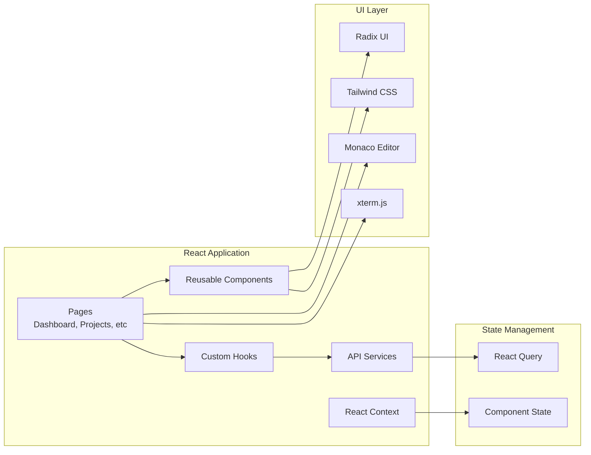
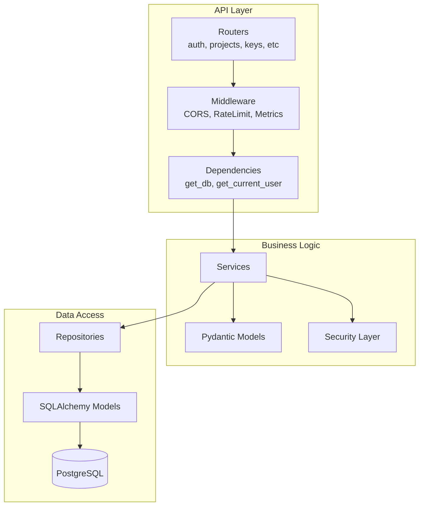
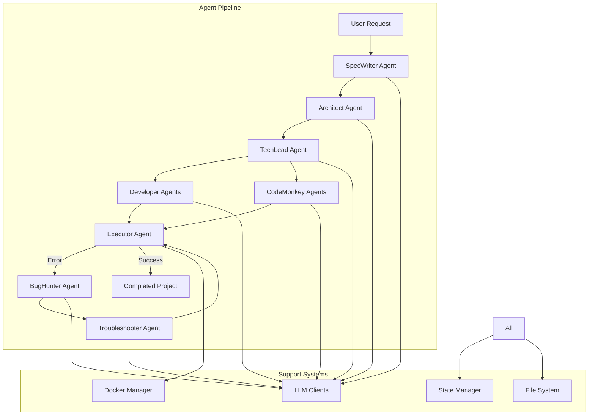
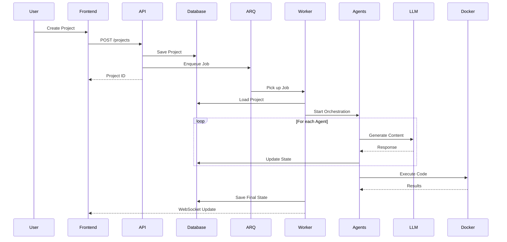
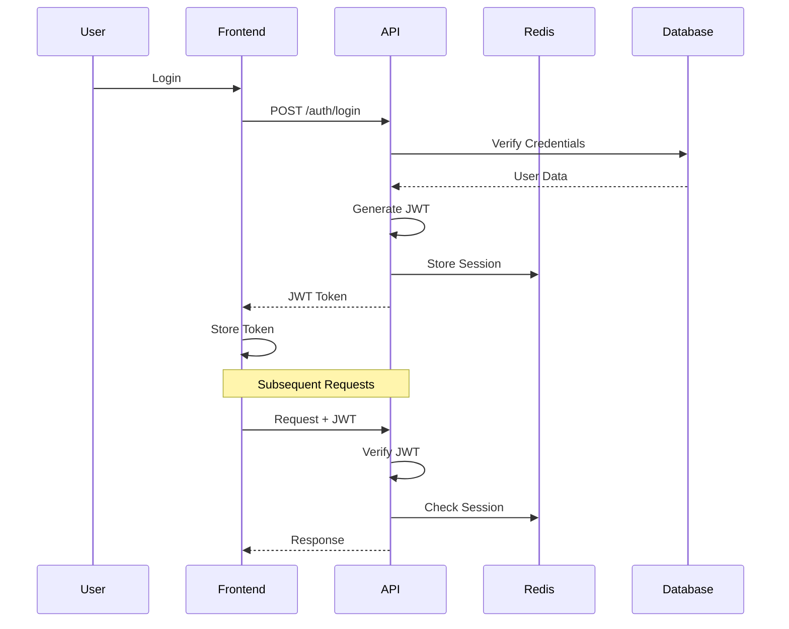
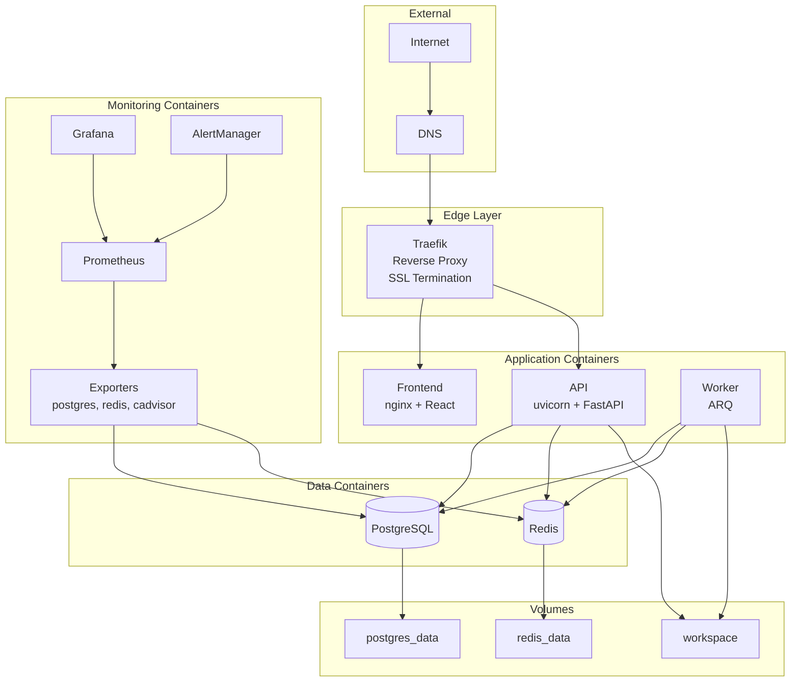

# Архитектурная Карта Samokoder

**Дата анализа**: 2025-10-06

## High-Level Architecture

## Component Architecture

### 1. Frontend Architecture

### 2. Backend API Architecture

### 3. Agent System Architecture

## Data Flow Architecture

### 1. Project Generation Flow

### 2. Authentication Flow

## Deployment Architecture

## Security Architecture

### Security Layers

1. **Network Security**
   - HTTPS via Traefik
   - CORS configuration
   - Network isolation (Docker networks)

2. **Application Security**
   - JWT Authentication
   - Rate Limiting (SlowAPI + Redis)
   - Input Validation (Pydantic)
   - CSRF Protection (planned)

3. **Data Security**
   - Password Hashing (bcrypt)
   - API Key Encryption (Fernet)
   - Database Encryption at Rest

4. **Infrastructure Security**
   - Docker Security Options
   - Read-only Docker Socket
   - Container Resource Limits
   - Automated Security Scanning (CI/CD)

## Scalability Considerations

### Current Limitations
1. **Single Worker Instance** - bottleneck for concurrent generations
2. **Single Database** - no read replicas
3. **Local File Storage** - not suitable for multi-host
4. **Large JSONB Columns** - performance impact

### Scaling Path
1. **Horizontal Scaling**
   - Multiple Worker instances (ARQ supports)
   - API load balancing
   - PostgreSQL read replicas

2. **Storage Scaling**
   - S3 for file storage
   - Redis Cluster
   - Database partitioning

3. **Performance Optimization**
   - Caching layer
   - CDN for static assets
   - Query optimization

## Technology Stack Summary

### Backend
- **Language**: Python 3.12+
- **Framework**: FastAPI (async)
- **ORM**: SQLAlchemy 2.0 (async)
- **Database**: PostgreSQL 15
- **Cache/Queue**: Redis 7
- **Background Jobs**: ARQ
- **LLM Integration**: OpenAI, Anthropic, Groq

### Frontend
- **Framework**: React 18
- **Language**: TypeScript
- **Build Tool**: Vite
- **UI Library**: Radix UI
- **State Management**: React Query
- **Styling**: Tailwind CSS

### Infrastructure
- **Containerization**: Docker
- **Orchestration**: Docker Compose
- **Reverse Proxy**: Traefik
- **Monitoring**: Prometheus + Grafana
- **CI/CD**: GitHub Actions