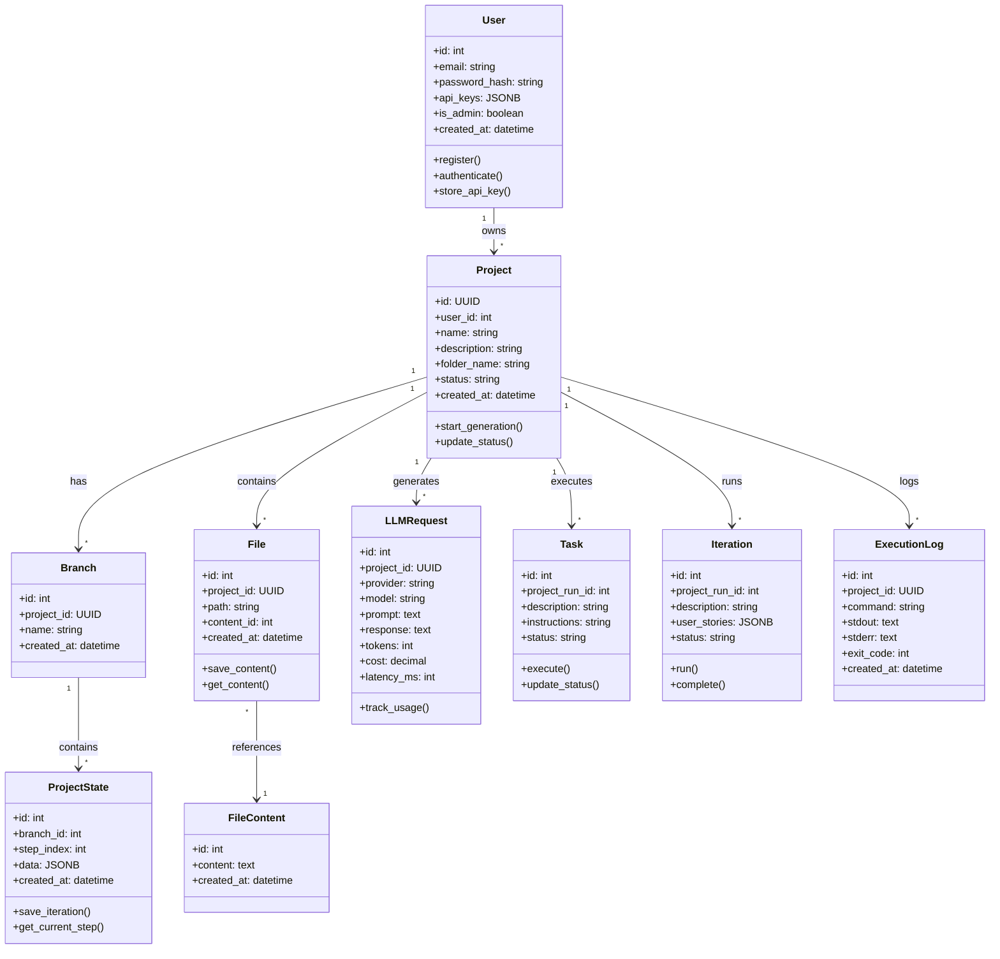
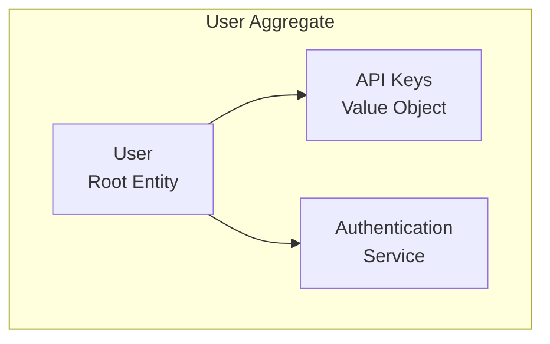
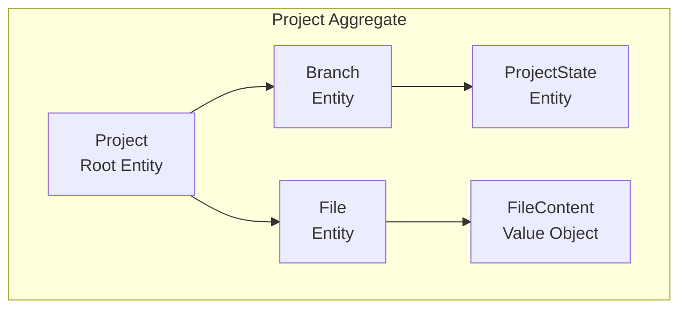
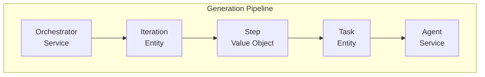
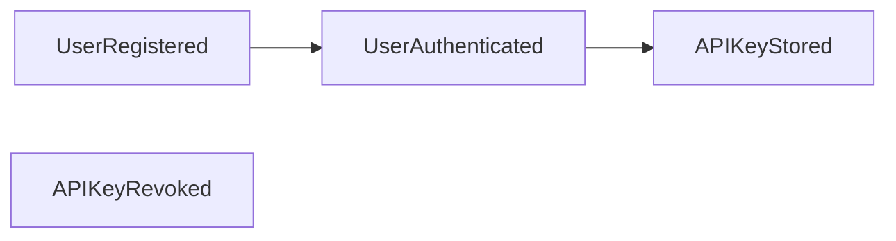
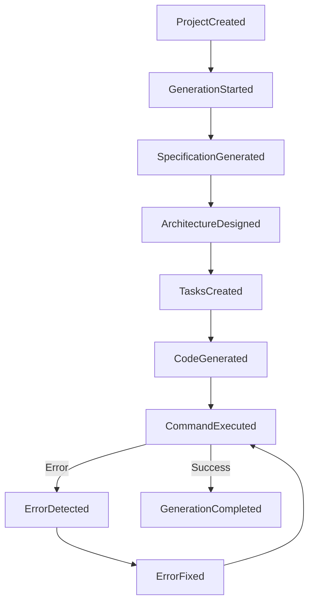
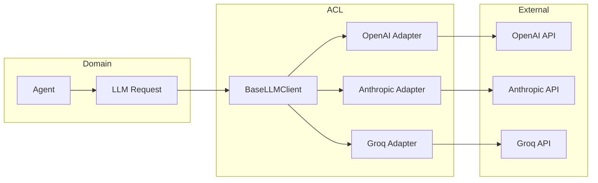
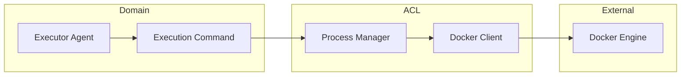
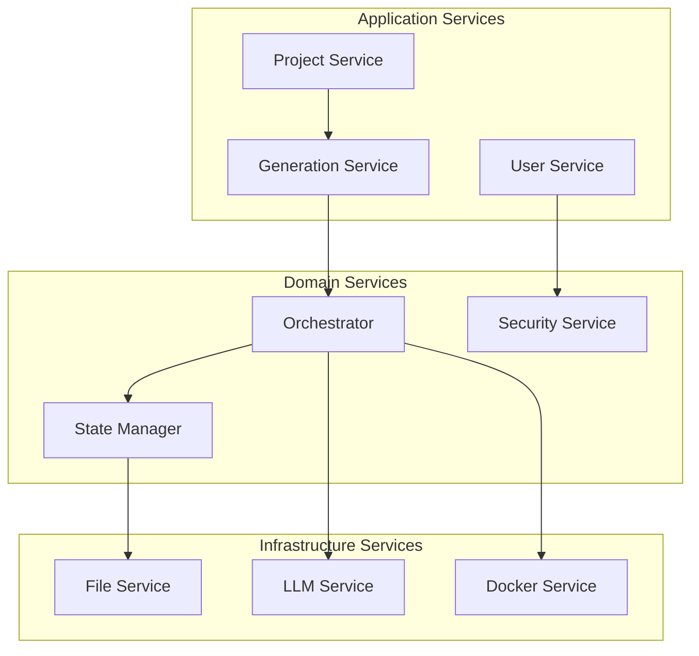

# Доменная Модель Samokoder

**Дата анализа**: 2025-10-06

## Domain Model Overview



## Aggregate Boundaries

### User Aggregate


**Invariants:**
- Email must be unique
- Password must be hashed with bcrypt
- API keys must be encrypted with Fernet
- JWT tokens expire after configured time

### Project Aggregate


**Invariants:**
- Project belongs to one User
- folder_name is auto-generated from name
- Deleting Project cascades to all related entities
- ProjectState is immutable (new step = new record)

### Generation Pipeline Aggregate


**Invariants:**
- Pipeline executes sequentially
- Parallel agents work on independent files only
- BugHunter activates only on errors
- Maximum 3 retry attempts per error

## Domain Events

### User Context Events


### Project Generation Events


## Value Objects

### Specification
```json
{
  "name": "string",
  "description": "string",
  "features": ["string"],
  "tech_stack": {
    "frontend": "string",
    "backend": "string",
    "database": "string"
  },
  "constraints": ["string"]
}
```

### Architecture
```json
{
  "structure": {
    "frontend": {},
    "backend": {},
    "database": {}
  },
  "dependencies": {},
  "deployment": {}
}
```

### ProjectState Data
```json
{
  "iterations": [{
    "description": "string",
    "user_stories": ["string"],
    "status": "pending|in_progress|completed"
  }],
  "steps": [{
    "type": "command|save_file|human_intervention",
    "content": "string",
    "related_files": ["string"]
  }],
  "tasks": [{
    "description": "string",
    "instructions": "string",
    "files": ["string"],
    "status": "pending|in_progress|done"
  }],
  "files": {},
  "epics": []
}
```

## Business Rules

### Authentication & Authorization
1. **User Registration**
   - Email must be unique
   - Password minimum 8 characters
   - Email verification (not implemented)

2. **API Access**
   - All endpoints require JWT except auth
   - Admin endpoints require is_admin=true
   - Rate limiting per endpoint

3. **API Key Management**
   - Users can store encrypted API keys
   - BYOK (Bring Your Own Key) model
   - Keys are provider-specific

### Project Generation
1. **Project Creation**
   - User must be authenticated
   - Project name required
   - Folder name auto-generated
   - Rate limited to 10/day

2. **Generation Pipeline**
   - Sequential execution of agents
   - Parallel execution for independent tasks
   - Automatic retry on failures (max 3)
   - Timeout per step (configurable)

3. **Resource Management**
   - Docker containers auto-cleanup after 24h
   - File size limits (not implemented)
   - Token usage tracking for billing

### Data Management
1. **File Storage**
   - Relative paths only (security)
   - Path traversal prevention
   - Immutable file content (versioning)

2. **State Management**
   - ProjectState is append-only
   - Complete state snapshot per step
   - JSON schema validation (partial)

3. **Audit & Analytics**
   - All LLM requests logged
   - Token usage tracked
   - Cost calculation per request
   - Performance metrics collected

## Anti-Corruption Layers

### LLM Provider ACL


### Docker Execution ACL


## Domain Service Interactions



## Consistency Boundaries

### Strong Consistency
- User registration/authentication
- Project creation/deletion
- Financial transactions (future)

### Eventual Consistency
- Project generation pipeline
- File synchronization
- Analytics aggregation

### Read Models (CQRS Pattern - Future)
- Project listing with filters
- Analytics dashboards
- Usage reports