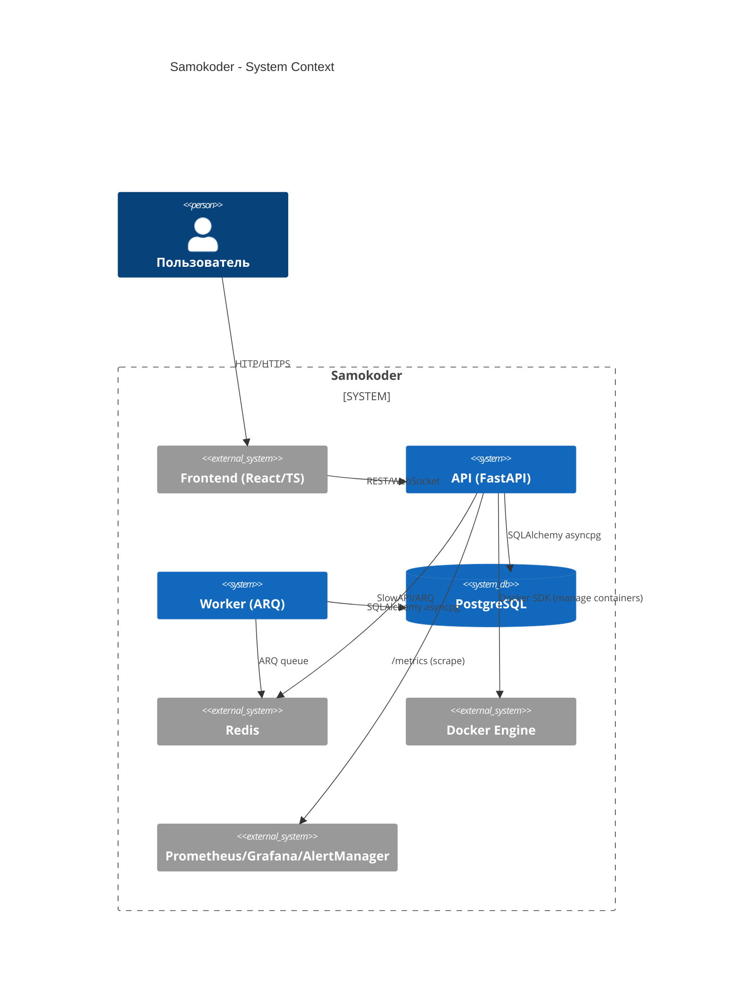

# Архитектурная модель (Фаза 3)

Статус: реконструкция на основе кода и спецификаций.

## Контекст (C4: System Context)


## Container (C4: Containers)
```mermaid
flowchart LR
  subgraph User
    U[Браузер]
  end
  subgraph Frontend[Frontend (Vite+React)]
    UI[Pages/Components]
    APIClient[Axios Client]
  end
  subgraph API[FastAPI]
    Routers>Routers v1]\n(auth, projects, keys, models, workspace, preview, plugins, analytics, usage, user, gitverse)
    Middleware[SecurityHeaders, RequestSizeLimit, SlowAPI, Metrics]
    Health[Health Router]
  end
  subgraph Core[Core Domain]
    Agents[AI Agents Orchestration]
    LLM[LLM Abstraction (OpenAI/Anthropic/Groq/OpenRouter)]
    State[State Manager]
    FS[VFS/Workspace]
    Proc[ProcessManager]
  end
  subgraph Worker[Background Worker (ARQ)]
    Task[run_generation_task]
  end
  DB[(PostgreSQL)]
  REDIS[(Redis)]
  DOCKER[[Docker Engine]]
  PROM[Prometheus/Grafana/AlertManager]

  U --> UI
  UI --> APIClient
  APIClient --> Routers
  Routers --> Middleware
  Routers --> Core
  Core --> DB
  Core --> REDIS
  Core --> DOCKER
  Worker --> REDIS
  Worker --> Core
  API --> PROM
```

## Критические потоки
- Регистрация/логин → JWT (httpOnly cookies, jti, ревокация) → лимиты.
- Создание проекта → DB → постановка задачи → worker (ARQ) → агенты → файлы/состояние.
- Превью проекта → запуск dev-процесса (ProcessManager) → возврат URL.
- Метрики → Prometheus `/metrics` → Grafana/AlertManager.

## Наблюдения
- CORS: строгий для production; RequestSizeLimit: per-endpoint; rate limiting: SlowAPI + Redis.
- docker.sock (ro) подключен: риск остаётся.
- Асинхронная модель в большинстве роутов; исправлены смешения sync/async в критичных местах.
