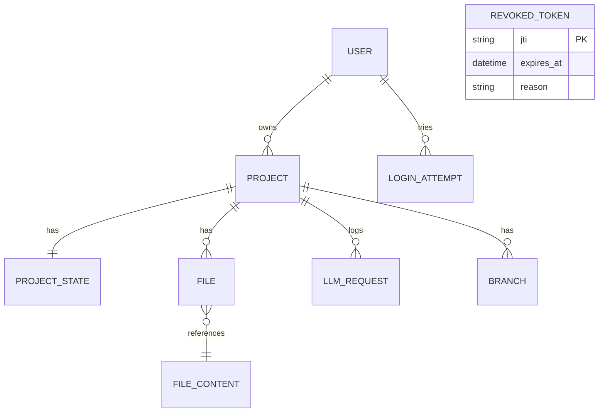

# Доменная модель (Фаза 3)

## Сущности и связи
- User (id, email, hashed_password, tier, api_keys[encrypted], api_key_settings, created_at, ...)
- Project (id UUID, user_id → User, name, description, status, timestamps)
- ProjectState (id, project_id → Project, data JSONB, step_index, timestamps)
- File (id, project_id → Project, path, content_id → FileContent)
- FileContent (id, content TEXT, created_at)
- LLMRequest (id, project_id, provider, model, prompt/response, tokens, cost, latency_ms, status, created_at)
- Branch (id, project_id, name)
- RevokedToken (jti, expires_at, reason)
- LoginAttempt (email, ip, success, created_at, user_agent, user_id?)
- ExecLog (command, stdout, stderr, exit_code, timeout)

## Инварианты
- (project_id, path) уникально в File.
- User.email уникален.
- API ключи шифруются (Fernet), хранение в JSONB.
- JWT с jti, доступен отзыв; access/refresh разделены ключами.

## Диаграмма (упрощённо)

## Замечания
- ProjectState.data (JSONB) крупный; нормализация начата миграциями (iterations/steps/tasks/epics индексы).
- Нужны дополнительные индексы для файлов и аналитики — миграции присутствуют.
