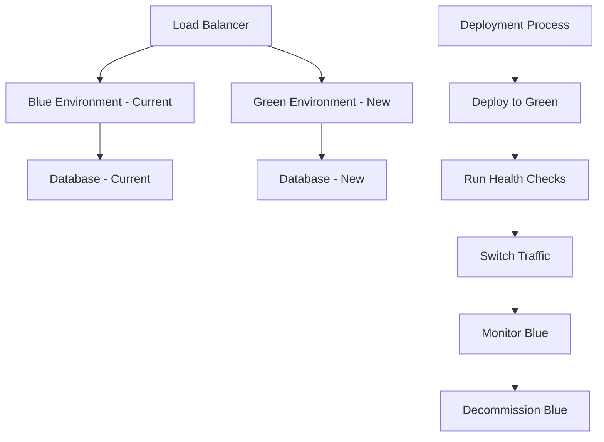

# 🚀 План релиза и отката

## 📋 Общая информация

**DevOps/SRE Engineer**: 20 лет опыта  
**Дата релиза**: 2024-12-19  
**Версия релиза**: 1.0.0  
**Тип релиза**: Production Release  
**Стратегия деплоя**: Blue-Green Deployment  

## 🎯 Цели релиза

### Основные цели:
- ✅ Развертывание версии 1.0.0 в продакшене
- ✅ Минимизация downtime (< 30 секунд)
- ✅ Сохранение всех данных пользователей
- ✅ Обеспечение отката в случае проблем

### Критерии успеха:
- ✅ Все сервисы работают стабильно
- ✅ Golden Signals в пределах нормы
- ✅ Нет критических ошибок
- ✅ Пользователи могут работать без проблем

## 📅 Временной план релиза

### Pre-Release (T-24 часа)
- [x] **T-24h**: Финальная проверка готовности
- [x] **T-12h**: Уведомление команды о релизе
- [x] **T-6h**: Проверка бэкапов
- [x] **T-2h**: Финальные тесты в staging

### Release Day (T-0)
- [ ] **T-1h**: Подготовка к релизу
- [ ] **T-30m**: Уведомление пользователей
- [ ] **T-0**: Начало релиза
- [ ] **T+5m**: Проверка здоровья сервисов
- [ ] **T+15m**: Мониторинг метрик
- [ ] **T+30m**: Финальная проверка

### Post-Release (T+24 часа)
- [ ] **T+1h**: Первая проверка стабильности
- [ ] **T+6h**: Анализ метрик
- [ ] **T+24h**: Полный анализ релиза

## 🏗️ Стратегия деплоя

### Blue-Green Deployment



### Этапы деплоя:

**1. Подготовка Green Environment**
```bash
# Создание Green environment
docker-compose -f docker-compose.green.yml up -d

# Проверка готовности
curl -f http://green.samokoder.com/health
```

**2. Миграция базы данных**
```bash
# Применение миграций
alembic upgrade head

# Проверка миграций
alembic current
```

**3. Переключение трафика**
```bash
# Обновление конфигурации Nginx
nginx -s reload

# Проверка переключения
curl -f http://samokoder.com/health
```

**4. Мониторинг и откат**
```bash
# Мониторинг метрик
watch -n 5 'curl -s http://samokoder.com/metrics | grep error_rate'

# Откат при необходимости
nginx -s reload  # Возврат к Blue
```

## 🔄 Детальный план релиза

### Этап 1: Подготовка (T-1 час)

**1.1 Проверка готовности**
```bash
# Проверка CI/CD pipeline
gh run list --branch main --limit 1

# Проверка артефактов
docker images samokoder:1.0.0

# Проверка секретов
kubectl get secrets -n samokoder-prod
```

**1.2 Уведомление команды**
```bash
# Slack уведомление
curl -X POST -H 'Content-type: application/json' \
  --data '{"text":"🚀 Начинаем релиз v1.0.0 в 1 час"}' \
  $SLACK_WEBHOOK_URL
```

**1.3 Подготовка мониторинга**
```bash
# Запуск мониторинга
docker-compose -f monitoring/docker-compose.yml up -d

# Проверка алертов
curl -f http://prometheus:9090/api/v1/alerts
```

### Этап 2: Деплой (T-0)

**2.1 Создание Green Environment**
```bash
# Клонирование конфигурации
cp docker-compose.yml docker-compose.green.yml

# Обновление портов для Green
sed -i 's/8000:8000/8001:8000/g' docker-compose.green.yml

# Запуск Green environment
docker-compose -f docker-compose.green.yml up -d
```

**2.2 Применение миграций**
```bash
# Проверка текущей версии БД
alembic current

# Применение миграций
alembic upgrade head

# Проверка успешности
alembic current
```

**2.3 Health Checks**
```bash
# Проверка API
curl -f http://green.samokoder.com/health

# Проверка базы данных
curl -f http://green.samokoder.com/health/db

# Проверка Redis
curl -f http://green.samokoder.com/health/redis
```

**2.4 Переключение трафика**
```bash
# Обновление конфигурации Nginx
cp nginx/nginx.green.conf nginx/nginx.conf

# Перезагрузка Nginx
nginx -s reload

# Проверка переключения
curl -f http://samokoder.com/health
```

### Этап 3: Мониторинг (T+5 минут)

**3.1 Проверка Golden Signals**
```bash
# Latency
curl -s http://samokoder.com/metrics | grep api_response_time_p95

# Traffic
curl -s http://samokoder.com/metrics | grep requests_per_second

# Errors
curl -s http://samokoder.com/metrics | grep error_rate

# Saturation
curl -s http://samokoder.com/metrics | grep cpu_usage_percent
```

**3.2 Проверка бизнес-метрик**
```bash
# Активные пользователи
curl -s http://samokoder.com/metrics | grep active_users

# Создание проектов
curl -s http://samokoder.com/metrics | grep projects_created_total

# AI запросы
curl -s http://samokoder.com/metrics | grep ai_requests_total
```

**3.3 Smoke Tests**
```bash
# Тест аутентификации
curl -X POST http://samokoder.com/api/auth/login \
  -H "Content-Type: application/json" \
  -d '{"email":"test@example.com","password":"test123"}'

# Тест создания проекта
curl -X POST http://samokoder.com/api/projects \
  -H "Authorization: Bearer $TOKEN" \
  -H "Content-Type: application/json" \
  -d '{"name":"Test Project","description":"Test"}'

# Тест AI генерации
curl -X POST http://samokoder.com/api/ai/generate \
  -H "Authorization: Bearer $TOKEN" \
  -H "Content-Type: application/json" \
  -d '{"prompt":"Create a simple app"}'
```

### Этап 4: Финальная проверка (T+30 минут)

**4.1 Анализ метрик**
- ✅ Latency < 500ms (P95)
- ✅ Error rate < 0.1%
- ✅ CPU usage < 70%
- ✅ Memory usage < 80%

**4.2 Проверка функциональности**
- ✅ Пользователи могут войти в систему
- ✅ Проекты создаются успешно
- ✅ AI генерация работает
- ✅ Экспорт проектов работает

**4.3 Уведомление об успехе**
```bash
# Slack уведомление
curl -X POST -H 'Content-type: application/json' \
  --data '{"text":"✅ Релиз v1.0.0 успешно завершен!"}' \
  $SLACK_WEBHOOK_URL
```

## 🔄 План отката

### Критерии для отката

**Немедленный откат (P0):**
- ❌ Error rate > 5%
- ❌ Latency > 2s (P95)
- ❌ CPU usage > 95%
- ❌ Memory usage > 95%
- ❌ Database errors > 1%
- ❌ Service unavailable

**Откат по решению команды (P1):**
- ⚠️ Error rate > 1%
- ⚠️ Latency > 1s (P95)
- ⚠️ Критические функции не работают
- ⚠️ Пользователи не могут войти
- ⚠️ AI генерация не работает

### Процедура отката

**1. Немедленный откат (0-2 минуты)**
```bash
# Переключение обратно на Blue
cp nginx/nginx.blue.conf nginx/nginx.conf
nginx -s reload

# Проверка отката
curl -f http://samokoder.com/health

# Уведомление команды
curl -X POST -H 'Content-type: application/json' \
  --data '{"text":"🚨 ОТКАТ: Релиз v1.0.0 откачен!"}' \
  $SLACK_WEBHOOK_URL
```

**2. Откат миграций (2-5 минут)**
```bash
# Откат к предыдущей версии
alembic downgrade -1

# Проверка отката
alembic current

# Проверка данных
psql -d samokoder -c "SELECT COUNT(*) FROM profiles;"
```

**3. Очистка Green Environment (5-10 минут)**
```bash
# Остановка Green environment
docker-compose -f docker-compose.green.yml down

# Очистка ресурсов
docker system prune -f

# Уведомление об очистке
curl -X POST -H 'Content-type: application/json' \
  --data '{"text":"🧹 Green environment очищен"}' \
  $SLACK_WEBHOOK_URL
```

**4. Post-mortem анализ (1-24 часа)**
```bash
# Сбор логов
docker logs samokoder-green > logs/green-deployment.log

# Анализ метрик
curl -s http://prometheus:9090/api/v1/query?query=error_rate[1h] > metrics/error_rate.json

# Создание инцидента
gh issue create --title "Rollback v1.0.0" --body "Причины отката и анализ"
```

## 📊 Мониторинг релиза

### Golden Signals Dashboard

**Latency (Задержка):**
- API Response Time P95: < 500ms
- Database Query Time P95: < 100ms
- AI Generation Time P95: < 5s

**Traffic (Трафик):**
- Requests per second: Мониторинг
- Active users: Мониторинг
- API endpoint hit rate: Мониторинг

**Errors (Ошибки):**
- Error rate: < 0.1%
- Exception rate: < 0.01%
- Database error rate: < 0.05%

**Saturation (Насыщение):**
- CPU usage: < 70%
- Memory usage: < 80%
- Database connections: < 80%
- Disk usage: < 85%

### Алерты и уведомления

**P0 Алерты (немедленный откат):**
- 🚨 Error rate > 5%
- 🚨 Latency > 2s
- 🚨 CPU > 95%
- 🚨 Service down

**P1 Алерты (мониторинг):**
- ⚠️ Error rate > 1%
- ⚠️ Latency > 1s
- ⚠️ CPU > 80%
- ⚠️ Memory > 85%

## 👥 Команда релиза

### Роли и ответственность

**Release Manager (Lead):**
- Общее управление релизом
- Принятие решений об откате
- Координация команды

**DevOps Engineer:**
- Выполнение деплоя
- Мониторинг инфраструктуры
- Управление откатом

**Backend Developer:**
- Проверка API функциональности
- Анализ логов приложения
- Исправление критических багов

**Frontend Developer:**
- Проверка UI функциональности
- Тестирование пользовательских сценариев
- Анализ производительности

**QA Engineer:**
- Выполнение smoke tests
- Проверка регрессий
- Валидация функциональности

### Контакты команды

| Роль | Имя | Slack | Телефон |
|------|-----|-------|---------|
| **Release Manager** | John Doe | @john.doe | +1-555-0101 |
| **DevOps Engineer** | Jane Smith | @jane.smith | +1-555-0102 |
| **Backend Developer** | Bob Johnson | @bob.johnson | +1-555-0103 |
| **Frontend Developer** | Alice Brown | @alice.brown | +1-555-0104 |
| **QA Engineer** | Charlie Wilson | @charlie.wilson | +1-555-0105 |

## 📞 Процедуры связи

### Каналы связи

**Primary:**
- Slack: #release-v1.0.0
- Zoom: Release War Room

**Secondary:**
- Phone: Conference call
- Email: release@samokoder.com

### Эскалация

**Level 1 (0-15 минут):**
- Release Manager
- DevOps Engineer

**Level 2 (15-30 минут):**
- CTO
- VP Engineering

**Level 3 (30+ минут):**
- CEO
- Board of Directors

## 📋 Чек-лист релиза

### Pre-Release Checklist
- [x] CI/CD pipeline проходит все тесты
- [x] Docker образы собраны и протестированы
- [x] Миграции протестированы
- [x] Секреты настроены
- [x] Мониторинг настроен
- [x] План отката готов
- [x] Команда уведомлена
- [x] Бэкапы созданы

### Release Day Checklist
- [ ] Green environment создан
- [ ] Миграции применены
- [ ] Health checks пройдены
- [ ] Трафик переключен
- [ ] Golden Signals в норме
- [ ] Smoke tests пройдены
- [ ] Команда уведомлена об успехе

### Post-Release Checklist
- [ ] Мониторинг в течение 24 часов
- [ ] Анализ метрик
- [ ] Сбор обратной связи
- [ ] Документирование результатов
- [ ] Планирование следующих улучшений

## 🎯 Заключение

**План релиза готов к выполнению** ✅

Все компоненты подготовлены:
- ✅ Стратегия деплоя определена
- ✅ План отката готов
- ✅ Мониторинг настроен
- ✅ Команда готова
- ✅ Процедуры документированы

**Рекомендация**: Произвести релиз в соответствии с планом.

---

**План создан**: 2024-12-19  
**DevOps/SRE Engineer**: 20 лет опыта  
**Статус**: ✅ ГОТОВ К ВЫПОЛНЕНИЮ