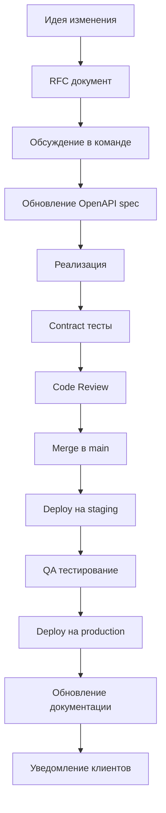
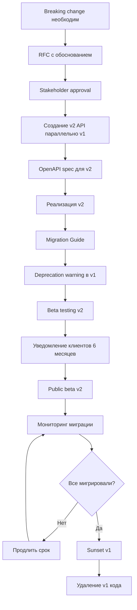

# Стратегия безопасной эволюции API

**Документ:** Руководство по развитию API без breaking changes  
**Версия:** 1.0  
**Дата:** 2025-10-06  
**Автор:** Владелец API (20 лет опыта)

---

## Содержание

1. [Введение](#введение)
2. [Принципы обратной совместимости](#принципы-обратной-совместимости)
3. [Классификация изменений](#классификация-изменений)
4. [Процессы внесения изменений](#процессы-внесения-изменений)
5. [Версионирование API](#версионирование-api)
6. [Deprecation Policy](#deprecation-policy)
7. [Примеры безопасных изменений](#примеры-безопасных-изменений)
8. [Чеклист для review](#чеклист-для-review)

---

## Введение

### Цели документа

Этот документ определяет правила и процессы для безопасной эволюции Samokoder API, обеспечивая:
- **Стабильность** для существующих клиентов
- **Инновации** для новых возможностей
- **Предсказуемость** изменений
- **Плавный переход** при необходимых breaking changes

### Ключевые принципы

1. **Backward Compatibility First** - приоритет обратной совместимости
2. **Explicit over Implicit** - явность вместо неявности
3. **Fail Loudly** - понятные сообщения об ошибках
4. **Progressive Enhancement** - постепенное улучшение
5. **Graceful Degradation** - изящная деградация

---

## Принципы обратной совместимости

### Robustness Principle (Закон Постела)

> "Be conservative in what you send, be liberal in what you accept"

#### Для API это означает:

**При приеме данных (requests):**
- ✅ Игнорировать неизвестные поля
- ✅ Принимать данные в разных форматах (где возможно)
- ✅ Предоставлять значения по умолчанию для опциональных полей
- ✅ Быть толерантным к вариациям регистра (где уместно)

**При отправке данных (responses):**
- ✅ Всегда включать обязательные поля
- ✅ Поддерживать стабильную структуру
- ✅ Добавлять новые поля как опциональные
- ✅ Документировать все изменения

### Semantic Versioning для API

Мы используем адаптированный Semantic Versioning:

```
/v{MAJOR}/endpoint
```

- **MAJOR** - breaking changes (v1 → v2)
- Внутри версии только обратно совместимые изменения

**Примеры:**
- `/v1/projects` - текущая версия
- `/v2/projects` - новая версия с breaking changes (когда потребуется)

---

## Классификация изменений

### 🟢 Безопасные изменения (Non-Breaking)

Не требуют новой версии API, можно добавлять в текущую версию.

#### 1. Новые эндпоинты

```yaml
# ✅ БЕЗОПАСНО
paths:
  /v1/projects/{id}/clone:  # НОВЫЙ эндпоинт
    post:
      summary: Clone project
```

**Обоснование:** Клиенты не используют несуществующие эндпоинты

#### 2. Новые опциональные поля в запросах

```json
// ✅ БЕЗОПАСНО
{
  "name": "Project",
  "description": "...",
  "tags": ["new", "optional"]  // НОВОЕ поле (опционально)
}
```

**Требования:**
- Поле должно быть опциональным
- Должно быть значение по умолчанию
- Старые клиенты могут не отправлять это поле

#### 3. Новые поля в ответах

```json
// ✅ БЕЗОПАСНО
{
  "id": "uuid",
  "name": "Project",
  "created_at": "...",
  "updated_at": "...",  // НОВОЕ поле
  "tags": []            // НОВОЕ поле
}
```

**Обоснование:** Клиенты должны игнорировать неизвестные поля (Robustness Principle)

#### 4. Новые query параметры

```
GET /v1/projects?sort=name&order=asc  // НОВЫЕ параметры
```

**Требования:**
- Параметры должны быть опциональными
- Должно быть поведение по умолчанию
- Старое поведение сохраняется без параметров

#### 5. Новые HTTP статус коды

```yaml
responses:
  '200':
    description: Success
  '404':
    description: Not Found
  '410':  # НОВЫЙ код
    description: Gone - resource permanently deleted
```

**Обоснование:** Клиенты обрабатывают неизвестные коды как ошибки

#### 6. Расширение enum значений

```python
# ✅ БЕЗОПАСНО (с оговоркой)
class Tier(Enum):
    FREE = "free"
    PRO = "pro"
    ENTERPRISE = "enterprise"
    ULTIMATE = "ultimate"  # НОВОЕ значение
```

**⚠️ Требования:**
- Клиенты должны обрабатывать неизвестные enum как default
- Документировать новое значение

#### 7. Более мягкая валидация

```python
# ✅ БЕЗОПАСНО
# Было: min_length=10
# Стало: min_length=5
```

**Обоснование:** Принимает больше входных данных, старые данные все еще валидны

#### 8. Добавление примеров и описаний

```yaml
# ✅ БЕЗОПАСНО
description: |
  Detailed description added  # Улучшенная документация
  
  Examples:
    - Example 1
    - Example 2
```

### 🔴 Breaking Changes (Несовместимые)

Требуют новой major версии API.

#### 1. Удаление эндпоинтов

```yaml
# ❌ BREAKING!
# Удален эндпоинт
# DELETE /v1/old-endpoint
```

**Решение:** Deprecation → новая версия

#### 2. Переименование полей

```json
// ❌ BREAKING!
{
  "project_name": "..."  // было "name"
}
```

**Решение:** Поддерживать оба поля в переходный период

#### 3. Изменение типов данных

```json
// ❌ BREAKING!
{
  "id": 123  // было string, стало integer
}
```

**Решение:** Новый эндпоинт или новая версия

#### 4. Удаление полей из ответов

```json
// ❌ BREAKING!
{
  "id": "...",
  "name": "..."
  // "description" удалено
}
```

**Решение:** Deprecation → пустое значение → новая версия

#### 5. Новые обязательные поля в запросах

```json
// ❌ BREAKING!
{
  "name": "Project",
  "tags": []  // НОВОЕ ОБЯЗАТЕЛЬНОЕ поле
}
```

**Решение:** Сделать опциональным с умным default

#### 6. Изменение семантики эндпоинта

```yaml
# ❌ BREAKING!
# GET /v1/projects
# Было: возвращает все проекты
# Стало: возвращает только активные проекты
```

**Решение:** Новый эндпоинт с другим URL

#### 7. Более строгая валидация

```python
# ❌ BREAKING!
# Было: min_length=5
# Стало: min_length=10
```

**Решение:** Постепенное ужесточение с предупреждениями

#### 8. Изменение формата данных

```json
// ❌ BREAKING!
{
  // Было: "2025-10-06T12:00:00Z" (ISO 8601)
  // Стало: "1633024800" (Unix timestamp)
  "created_at": "1633024800"
}
```

**Решение:** Поддерживать оба формата или новая версия

### 🟡 Потенциально Breaking (зависит от контекста)

#### 1. Изменение порядка полей в response

```json
// 🟡 МОЖЕТ БЫТЬ BREAKING
// Было:
{"name": "...", "id": "..."}
// Стало:
{"id": "...", "name": "..."}
```

**Зависит от:** Парсера клиента (JSON не зависит от порядка, но некоторые парсеры могут)

#### 2. Изменение в пагинации

```json
// 🟡 МОЖЕТ БЫТЬ BREAKING
// Было: page, per_page
// Стало: offset, limit
```

**Решение:** Поддерживать оба формата

#### 3. Новые обязательные headers

```
// 🟡 МОЖЕТ БЫТЬ BREAKING
X-API-Version: v1  // Новый обязательный header
```

**Решение:** Делать опциональным с auto-detect

---

## Процессы внесения изменений

### Процесс для безопасных изменений (Non-Breaking)



**Срок:** 1-2 недели

**Чеклист:**
- [ ] RFC создан и одобрен
- [ ] OpenAPI spec обновлен
- [ ] Реализация соответствует spec
- [ ] Contract тесты добавлены
- [ ] Unit тесты покрывают изменения
- [ ] Integration тесты пройдены
- [ ] Code review завершен
- [ ] Документация обновлена
- [ ] Changelog обновлен
- [ ] Клиенты уведомлены (если существенно)

### Процесс для Breaking Changes



**Срок:** 6-18 месяцев

**Чеклист:**
- [ ] RFC с бизнес-обоснованием
- [ ] Альтернативы рассмотрены
- [ ] Stakeholder buy-in получен
- [ ] v2 спроектирован и одобрен
- [ ] Migration guide написан
- [ ] Инструменты миграции созданы
- [ ] v1 deprecation warnings добавлены
- [ ] Email кампания запущена
- [ ] Documentation обновлена для обеих версий
- [ ] Метрики миграции настроены
- [ ] Support team обучен
- [ ] v2 в production и стабилен
- [ ] 90%+ клиентов мигрировали
- [ ] Grace period завершен
- [ ] v1 sunset выполнен

---

## Версионирование API

### Текущий подход: URL-based versioning

```
https://api.samokoder.io/v1/projects
                         ^^
                         major version
```

#### Преимущества:
- ✅ Явность и простота
- ✅ Легко кэшировать
- ✅ Легко роутить
- ✅ Видно в логах и метриках
- ✅ Поддержка браузеров

#### Недостатки:
- ❌ URL дублирование
- ❌ Сложнее для клиентских библиотек

### Альтернативы (не рекомендуются для нас)

#### Header-based versioning
```http
GET /projects HTTP/1.1
Accept-Version: v1
```

#### Content negotiation
```http
GET /projects HTTP/1.1
Accept: application/vnd.samokoder.v1+json
```

#### Query parameter (не рекомендуется)
```
GET /projects?version=1
```

### Правила версионирования

1. **Major version в URL**
   ```
   /v1/endpoint  ✅
   /v1.2/endpoint  ❌
   ```

2. **Minor/patch версии не в URL**
   - Отслеживаются через Git tags
   - Видны в `/` эндпоинте
   - Видны в response headers

3. **Parallel версии поддерживаются**
   ```python
   # api/main.py
   app.include_router(v1_router, prefix="/v1")
   app.include_router(v2_router, prefix="/v2")
   ```

4. **Minimum 2 версии активны одновременно**
   - v1: deprecated, поддерживается
   - v2: текущая, рекомендуется

5. **Version в response headers**
   ```http
   HTTP/1.1 200 OK
   X-API-Version: 1.0.5
   X-API-Latest-Version: 2.0.0
   X-API-Deprecated: false
   ```

---

## Deprecation Policy

### Временные рамки

```
┌─────────────────────────────────────────────────────────────┐
│                        Timeline                              │
├─────────────────────────────────────────────────────────────┤
│ T+0     │ Announcement (email, blog, docs)                  │
│ T+1 mo  │ Deprecation warnings in responses                 │
│ T+3 mo  │ API console warnings                              │
│ T+6 mo  │ Soft sunset (rate limiting)                       │
│ T+12 mo │ Hard sunset (404 responses)                       │
│ T+18 mo │ Code deletion                                     │
└─────────────────────────────────────────────────────────────┘
```

### Deprecation Warning Format

#### Response Headers
```http
HTTP/1.1 200 OK
Deprecation: true
Sunset: Sat, 31 Dec 2025 23:59:59 GMT
Link: </v2/projects>; rel="alternate"
X-API-Warn: "This endpoint is deprecated. Migrate to /v2/projects by 2025-12-31"
```

#### Response Body
```json
{
  "data": {...},
  "_meta": {
    "deprecated": true,
    "sunset_date": "2025-12-31T23:59:59Z",
    "alternative_endpoint": "/v2/projects",
    "migration_guide": "https://docs.samokoder.io/migration/v1-to-v2",
    "reason": "Improved performance and consistency"
  }
}
```

### Changelog Entry Template

```markdown
## [2025-10-15] - Deprecation Notice

### Deprecated
- `GET /v1/old-endpoint` - Use `/v2/new-endpoint` instead
  - **Sunset Date:** 2026-04-15 (6 months)
  - **Reason:** Improved performance and consistency
  - **Migration Guide:** https://docs.samokoder.io/migration/old-to-new
  - **Breaking Changes:**
    - Field `old_field` renamed to `new_field`
    - Response format changed from array to paginated object
  - **Action Required:**
    - Update client code to use new endpoint
    - Update field mappings
    - Test with new response format

### Support
- Questions: support@samokoder.io
- Slack: #api-migration
- Office Hours: Fridays 3-4pm UTC
```

### Email Template

```
Subject: [Action Required] API Deprecation Notice - /v1/old-endpoint

Dear Samokoder API User,

We're writing to inform you that the following API endpoint will be deprecated:

ENDPOINT: GET /v1/old-endpoint
SUNSET DATE: April 15, 2026 (6 months from now)
USAGE: Your application made 1,234 requests to this endpoint in the last 30 days

WHY:
We're deprecating this endpoint to provide improved performance and consistency
in our API. The new endpoint offers better error handling and pagination.

ACTION REQUIRED:
Please migrate to the new endpoint: GET /v2/new-endpoint

MIGRATION GUIDE:
https://docs.samokoder.io/migration/old-to-new

TIMELINE:
- Now - Dec 31: Both endpoints available
- Jan 1: Deprecation warnings added to responses
- Mar 1: Rate limiting applied (100 req/min)
- Apr 15: Endpoint returns 404

SUPPORT:
- Documentation: https://docs.samokoder.io
- Email: support@samokoder.io
- Slack: #api-migration
- Office Hours: Fridays 3-4pm UTC

We're committed to making this transition as smooth as possible.
Thank you for being a valued Samokoder user!

Best regards,
The Samokoder API Team
```

---

## Примеры безопасных изменений

### 1. Добавление поля в response

#### ✅ Безопасно

```yaml
# БЫЛО
ProjectResponse:
  properties:
    id:
      type: string
    name:
      type: string
    created_at:
      type: string

# СТАЛО
ProjectResponse:
  properties:
    id:
      type: string
    name:
      type: string
    created_at:
      type: string
    updated_at:  # НОВОЕ поле
      type: string
    tags:  # НОВОЕ поле
      type: array
      items:
        type: string
```

#### Реализация

```python
# core/db/models/project.py
class Project(Base):
    # ... existing fields ...
    updated_at: datetime = Column(DateTime, default=datetime.utcnow, onupdate=datetime.utcnow)
    tags: list = Column(JSON, default=list)

# core/api/models/projects.py
class ProjectResponse(BaseModel):
    id: UUID
    name: str
    created_at: datetime
    # NEW fields
    updated_at: Optional[datetime] = None
    tags: List[str] = []
```

#### Migration

```python
# alembic/versions/xxx_add_project_fields.py
def upgrade():
    op.add_column('projects', sa.Column('updated_at', sa.DateTime(), nullable=True))
    op.add_column('projects', sa.Column('tags', sa.JSON(), nullable=True))
    
    # Set default values for existing rows
    op.execute("UPDATE projects SET updated_at = created_at WHERE updated_at IS NULL")
    op.execute("UPDATE projects SET tags = '[]' WHERE tags IS NULL")

def downgrade():
    op.drop_column('projects', 'tags')
    op.drop_column('projects', 'updated_at')
```

### 2. Добавление опционального query параметра

#### ✅ Безопасно

```python
# api/routers/projects.py

# БЫЛО
@router.get("/", response_model=ProjectListResponse)
async def list_projects(
    current_user: User = Depends(get_current_user),
    db: AsyncSession = Depends(get_async_db),
):
    result = await db.execute(
        select(Project)
        .where(Project.user_id == current_user.id)
        .order_by(Project.created_at.desc())
    )
    projects = result.scalars().all()
    return ProjectListResponse(projects=projects, total=len(projects))

# СТАЛО
@router.get("/", response_model=ProjectListResponse)
async def list_projects(
    current_user: User = Depends(get_current_user),
    db: AsyncSession = Depends(get_async_db),
    # NEW: опциональные параметры сортировки
    sort: Optional[str] = Query(None, regex="^(name|created_at|updated_at)$"),
    order: Optional[str] = Query("desc", regex="^(asc|desc)$"),
):
    query = select(Project).where(Project.user_id == current_user.id)
    
    # Apply sorting if specified
    if sort:
        column = getattr(Project, sort)
        query = query.order_by(column.asc() if order == "asc" else column.desc())
    else:
        # Default sorting (backward compatible)
        query = query.order_by(Project.created_at.desc())
    
    result = await db.execute(query)
    projects = result.scalars().all()
    return ProjectListResponse(projects=projects, total=len(projects))
```

### 3. Добавление нового эндпоинта

#### ✅ Безопасно

```python
# api/routers/projects.py

@router.post("/{project_id}/clone", response_model=ProjectDetailResponse)
async def clone_project(
    project_id: UUID,
    current_user: User = Depends(get_current_user),
    db: AsyncSession = Depends(get_async_db),
):
    """
    Clone an existing project.
    
    This is a NEW endpoint added in v1.1.0.
    Creates a copy of the project with a new ID.
    """
    # Get original project
    result = await db.execute(
        select(Project).where(Project.id == project_id, Project.user_id == current_user.id)
    )
    original = result.scalars().first()
    
    if not original:
        raise HTTPException(status_code=404, detail="Project not found")
    
    # Create clone
    clone = Project(
        name=f"{original.name} (Copy)",
        description=original.description,
        user_id=current_user.id,
        tags=original.tags.copy() if original.tags else []
    )
    
    db.add(clone)
    await db.commit()
    await db.refresh(clone)
    
    return ProjectDetailResponse(project=ProjectResponse.model_validate(clone))
```

#### OpenAPI Update

```yaml
paths:
  /v1/projects/{project_id}/clone:
    post:
      tags:
        - projects
      summary: Clone a project
      description: |
        Creates a copy of an existing project.
        
        **Added in:** v1.1.0
        **Реализация:** api/routers/projects.py:XXX
      operationId: cloneProject
      parameters:
        - $ref: '#/components/parameters/ProjectId'
      responses:
        '200':
          description: Project cloned successfully
          content:
            application/json:
              schema:
                $ref: '#/components/schemas/ProjectDetailResponse'
```

### 4. Расширение enum значений

#### ✅ Безопасно (с оговоркой)

```python
# core/db/models/user.py

# БЫЛО
class Tier(str, Enum):
    FREE = "free"
    PRO = "pro"
    ENTERPRISE = "enterprise"

# СТАЛО
class Tier(str, Enum):
    FREE = "free"
    PRO = "pro"
    ENTERPRISE = "enterprise"
    ULTIMATE = "ultimate"  # NEW tier
```

#### Migration

```python
# alembic/versions/xxx_add_ultimate_tier.py

# Для PostgreSQL с enum типом:
from alembic import op

def upgrade():
    # Add new value to enum
    op.execute("ALTER TYPE tier ADD VALUE 'ultimate'")

def downgrade():
    # Downgrade сложнее - нужно пересоздавать enum
    # Обычно не делается для production
    pass
```

#### Client Compatibility

```python
# Клиент должен обрабатывать неизвестные значения

# ❌ НЕ ДЕЛАТЬ ТАК
if tier == "free":
    # ...
elif tier == "pro":
    # ...
else:
    raise ValueError("Unknown tier")  # Сломается при "ultimate"

# ✅ ДЕЛАТЬ ТАК
TIER_FEATURES = {
    "free": {...},
    "pro": {...},
    "enterprise": {...}
}

features = TIER_FEATURES.get(tier, TIER_FEATURES["free"])  # Default fallback
```

### 5. Добавление validation с учетом обратной совместимости

#### ✅ Безопасно

```python
# core/api/models/projects.py

# БЫЛО
class ProjectCreateRequest(BaseModel):
    name: str = Field(..., min_length=1, max_length=100)
    description: Optional[str] = Field(None, max_length=1000)

# СТАЛО
class ProjectCreateRequest(BaseModel):
    name: str = Field(..., min_length=1, max_length=100)
    description: Optional[str] = Field(None, max_length=1000)
    tags: List[str] = Field(default_factory=list, max_items=10)  # NEW field
    
    @validator('tags')
    def validate_tags(cls, v):
        """Validate project tags."""
        if not v:
            return []
        
        # Each tag должен быть валидным
        for tag in v:
            if not tag or len(tag) > 50:
                raise ValueError('Tag must be 1-50 characters')
            if not tag.replace('-', '').replace('_', '').isalnum():
                raise ValueError('Tag must contain only alphanumeric, dash, underscore')
        
        # Unique tags only
        return list(set(v))
```

---

## Чеклист для Code Review

### Для любого изменения API

- [ ] **OpenAPI спецификация обновлена**
  - [ ] Новые эндпоинты документированы
  - [ ] Схемы обновлены
  - [ ] Примеры добавлены
  - [ ] Описания понятны

- [ ] **Backward compatibility проверена**
  - [ ] Существующие эндпоинты работают без изменений
  - [ ] Новые поля опциональны
  - [ ] Старые клиенты не сломаются

- [ ] **Тесты добавлены**
  - [ ] Unit тесты для новой логики
  - [ ] Integration тесты для эндпоинтов
  - [ ] Contract тесты обновлены
  - [ ] Тесты обратной совместимости

- [ ] **Документация обновлена**
  - [ ] API docs актуальны
  - [ ] Migration guide (если нужен)
  - [ ] Changelog обновлен
  - [ ] Примеры кода обновлены

- [ ] **Безопасность проверена**
  - [ ] Аутентификация на месте
  - [ ] Авторизация корректна
  - [ ] Input validation достаточна
  - [ ] Rate limiting применен (если нужен)

- [ ] **Производительность учтена**
  - [ ] N+1 queries проверены
  - [ ] Индексы БД на месте
  - [ ] Pagination реализована (для списков)
  - [ ] Caching рассмотрен

### Для breaking changes

- [ ] **Обоснование задокументировано**
  - [ ] RFC создан
  - [ ] Альтернативы рассмотрены
  - [ ] Бизнес-кейс понятен

- [ ] **Migration plan готов**
  - [ ] Migration guide написан
  - [ ] Инструменты миграции созданы
  - [ ] Timeline определен
  - [ ] Communication plan готов

- [ ] **Parallel версии поддерживаются**
  - [ ] v1 остается рабочей
  - [ ] v2 полностью функциональна
  - [ ] Роутинг корректен

- [ ] **Deprecation процесс запущен**
  - [ ] Warnings добавлены в v1
  - [ ] Email уведомления отправлены
  - [ ] Документация обновлена для обеих версий
  - [ ] Метрики миграции настроены

---

## Примеры из практики

### Case Study 1: Добавление пагинации

**Проблема:** Эндпоинт `/v1/projects` возвращает все проекты, что неэффективно для пользователей с сотнями проектов.

**❌ Breaking подход:**
```python
# Изменить response format - BREAKING!
# Было: {projects: [...], total: N}
# Стало: {items: [...], page: 1, total_pages: 10}
```

**✅ Non-breaking подход:**
```python
@router.get("/", response_model=ProjectListResponse)
async def list_projects(
    # NEW: опциональная пагинация
    page: Optional[int] = Query(None, ge=1),
    limit: Optional[int] = Query(None, ge=1, le=100),
    # ... existing params
):
    if page is not None and limit is not None:
        # Paginated response
        offset = (page - 1) * limit
        query = query.offset(offset).limit(limit)
        
        total_result = await db.execute(
            select(func.count()).select_from(base_query)
        )
        total = total_result.scalar()
        
        # Добавить метаданные в существующий формат
        projects = result.scalars().all()
        response = ProjectListResponse(projects=projects, total=total)
        # Опционально добавить пагинацию в _meta
        response._meta = {
            "page": page,
            "limit": limit,
            "total_pages": (total + limit - 1) // limit
        }
        return response
    else:
        # Старое поведение - вернуть все
        # Backward compatible
        ...
```

### Case Study 2: Изменение формата даты

**Проблема:** Нужно поддерживать Unix timestamps для мобильных клиентов.

**❌ Breaking подход:**
```json
// Изменить формат для всех
{"created_at": 1633024800}
```

**✅ Non-breaking подход:**
```python
class ProjectResponse(BaseModel):
    # Существующее поле
    created_at: datetime
    
    # NEW: альтернативный формат
    created_at_unix: Optional[int] = None
    
    @validator('created_at_unix', always=True)
    def compute_unix_timestamp(cls, v, values):
        if 'created_at' in values:
            return int(values['created_at'].timestamp())
        return v
```

**Или через query parameter:**
```python
@router.get("/{id}")
async def get_project(
    date_format: str = Query("iso", regex="^(iso|unix)$")
):
    # Return response with appropriate format
    ...
```

---

## Заключение

### Ключевые выводы

1. **Планируйте заранее** - думайте о будущих изменениях при проектировании
2. **Тестируйте тщательно** - contract tests предотвращают breaking changes
3. **Коммуницируйте четко** - держите клиентов в курсе изменений
4. **Версионируйте осознанно** - breaking changes требуют новой версии
5. **Deprecate gracefully** - давайте время на миграцию

### Полезные ресурсы

- **OpenAPI Specification:** https://spec.openapis.org/oas/v3.1.0
- **API Versioning Best Practices:** https://www.troyhunt.com/your-api-versioning-is-wrong/
- **Robustness Principle:** https://en.wikipedia.org/wiki/Robustness_principle
- **Semantic Versioning:** https://semver.org/

### Контакты

- **API Owner:** api-owner@samokoder.io
- **Slack:** #api-development
- **Office Hours:** Пятница 15:00-16:00 UTC

---

**Документ утвержден:** API Owner  
**Последнее обновление:** 2025-10-06  
**Версия:** 1.0
